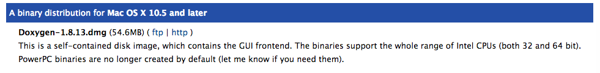

## Doxygen inštalácia na macOS

Máte dve možnosti:

* #### Ak ste si nainštalovali alebo nainštalujete [Homebrew](/qt-creator/homebrew-osx.md), otvorte terminál a napíšte:

```terminal
brew install doxygen
```

* #### Ak Homebrew nemáte, stiahnite si inštalačný balíček pre [Doxygen](http://www.stack.nl/~dimitri/doxygen/download.html).

V dolnej časti vyhladajte distribúciu pre Mac OS X, a stiahnite si ju.



Otvorte stiahnutý súbor. Na inštalačný súbor Doxygen _kliknite pravým a vyberte možnosť Open_.  
>Pozor! Táto kombinácia **nie je **ekvivalentná obyčajnému otvoreniu súboru dvojklikom! Dokončite inštaláciu.


 


