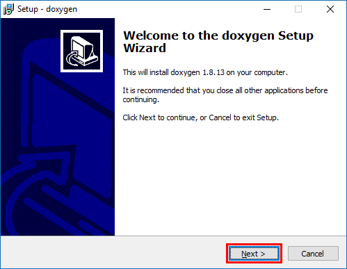
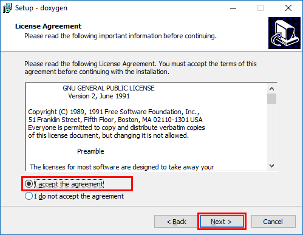
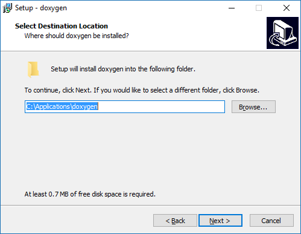
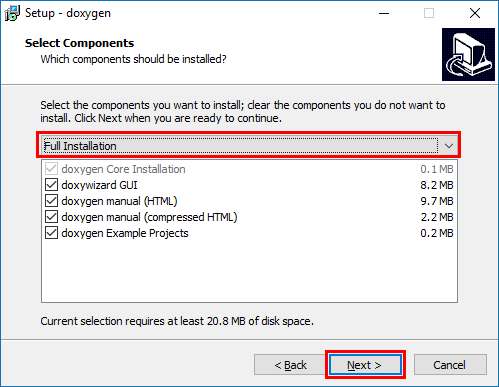

# Inštalácia Doxygen na Windows {#intro}

1. Stiahnie si inštalátor zo stránky [http://ftp.stack.nl/pub/users/dimitri/doxygen-1.8.13-setup.exe](http://ftp.stack.nl/pub/users/dimitri/doxygen-1.8.13-setup.exe) .

2. Spustite inštalátor a postupujte:

   
   
3. Prijmite licenčné podmienky:

   
   
4. Nainštalovať Doxygen môžete podľa svojej voľby:
   
   
   
5. Zvoľte "Full Installation" a iba pokračujte v potvrdzovaní inštalačných krokov:

    

 

