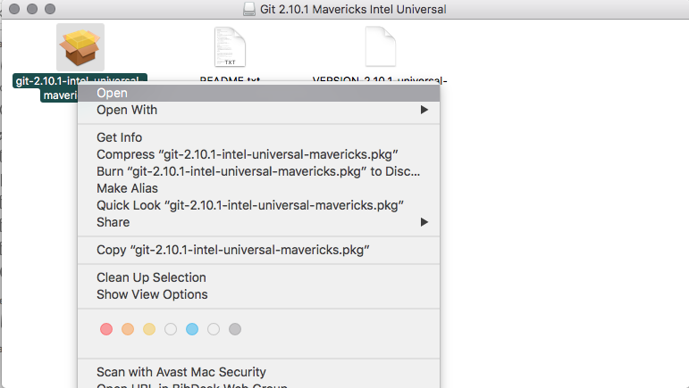

## Git inštalácia - OS X

Máte dve možnosti:

* #### ak ste si nainštalovali alebo nainštalujete [Homebrew](/qt-creator/homebrew-osx.md), otvorte terminál a napíšte:

```terminal
brew install git
```

* #### ak Homebrew nemáte, stiahnite si inštalačný balíček pre [Git](https://git-scm.com/download/mac).

Otvorte tento súbor. Na inštalačný súbor git-... _kliknite pravým a vyberte možnosť Open_. Pozor! Táto kombinácia nie je ekvivalentná obyčajnému otvoreniu súboru dvojklikom! Dokončite inštaláciu.



