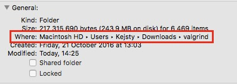

# Valgrind na Mac OS X {#intro}

Ak máte najnovšiu verziu operačného systému OS X - Sierra, doporučujem vám pozrieť sa radšej na Dr.Memory.

Máte tri možnosti.

#### * Ak ste si nainštalovali alebo nainštalujete [Homebrew](/qt-creator/homebrew-osx.md), otvorte terminál a napíšte:

```terminal
brew install valgrind
```

Pozor! Ak máte nainštalovanú najnovšiu nerziu OS X Sierra, je možné, že brew zlyhá s hláškou

```terminal
versions newer than El Capitan due to an upstream incompatibility.
Error: An unsatisfied requirement failed this build.
```

V tomto prípade použite druhú možnosť inštalácie.

####* Ak Homebrew nemáte, stiahnite si inštalačnú binárku pre [Vallgrind](http://valgrind.org/downloads/).

Pozor! limited support for 10.11 and 10.12

Otvorte stiahnutý súbor a dekomprimujte ho.


Na vzniknutý priečinok kliknite pravým klikom a vyberte možnosť_ Get Info._


V otvorenom okne zistíte, kde máte súbor uložený.



Otvorte terminál.

V príklade je cesta k priečinku : **/Users/Kejsty/Downloads/valgrind/**  
a názov priečinku **valgrind-3.12.0**

Napíšte:

```terminal
cd /Users/Kejsty/Downloads/valgrind/valgrind-3.12.0
./configure
make
```

A dúfajte, všetko prebehne v poriadku. Ak nie, skúste tretiu možnosť

####* Otvorte terminál a presunte na \(pomocou cd {directory}\) na miesto, kam chcete valgrind stiahnuť.

Postupne aplikujte nasledovné príkazy v termináli:

```terminal
curl -OL http://ftpmirror.gnu.org/autoconf/autoconf-2.69.tar.gz
tar -xzf autoconf-2.69.tar.gz 
cd autoconf-2.69
./configure && make && sudo make install
cd ..

curl -OL http://ftpmirror.gnu.org/automake/automake-1.14.tar.gz
tar -xzf automake-1.14.tar.gz
cd automake-1.14
./configure && make && sudo make install
cd..

curl -OL http://ftpmirror.gnu.org/libtool/libtool-2.4.2.tar.gz
tar -xzf libtool-2.4.2.tar.gz
cd libtool-2.4.2
./configure && make && sudo make install
cd ..

svn co svn://svn.valgrind.org/valgrind/trunk valgrind
cd valgrind
./autogen.sh
./configure -disable-tls --enable-only64bit --build=amd64-darwin 
make
sudo make install 
```

Prvé tri balíčky vám umožnia spustiť skript **autogen.sh**, ktorý nakonfiguruje prostredie a pripraví ho pre kompiláciu.   
**svn://svn.valgrind.org/valgrind/trunk** obsahuje najnovšiu binárku pre valgrind.


