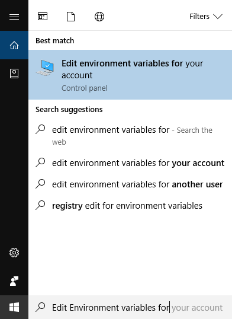
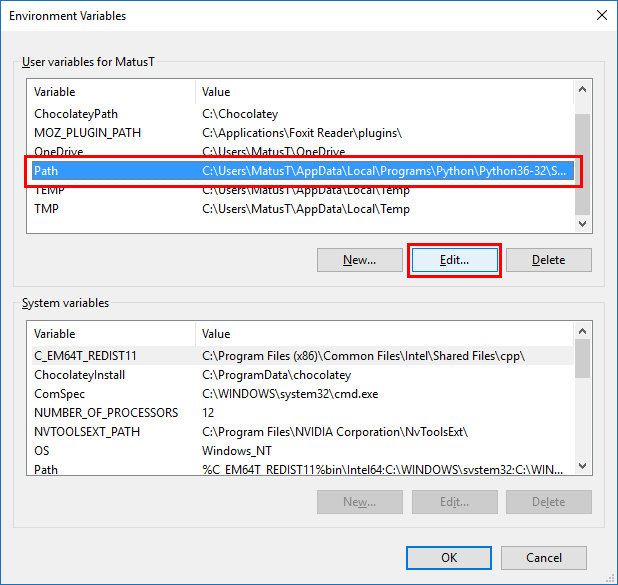
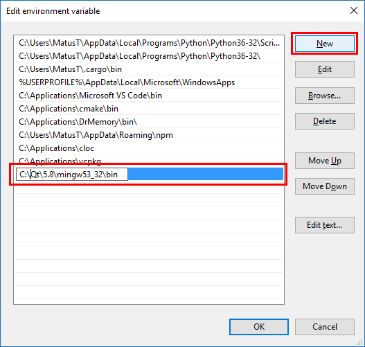

# Windows a Dr. Memory

## Inštalácia

1. Stiahnite si inštalátor z adresy [https://github.com/DynamoRIO/drmemory/releases/download/release_1.11.0/DrMemory-Windows-1.11.0-2.msi](https://github.com/DynamoRIO/drmemory/releases/download/release_1.11.0/DrMemory-Windows-1.11.0-2.msi).
2. Spustite a postupujte inštalátorom.

## Podpora pre Qt Creator/MinGW

Binárne súbory vyprodukované kompilátorom MinGW(odporúčaný a používaný v tutoriáloch) su závislé na nietkorých jeho knižniciach(**.dll** súbory) bez ktorých sa program nespustí. Tieto .dll súbory môžete buď skopírovať k Vášmu .exe programu alebo povedať systému, kde sa nachádzaju, čo je tá jednoduchšia cesta. Ak ste nemenili cestu inštalácie, MinGW knižnice sa budú nachádzať v **C:\Qt\5.8\mingw53_32\bin**.





## Použitie

1. Spustite PowerShell.
2. Pomocou príkazu **cd** zanavigujte sa do priečinka so skompilovaným programom. *Qt Creator* vytvára zložku **build-{projekt}** vedľa folderu projektu a v nej ďalej rozdeluje na Debug a Release, pričom zvoliť by ste mali **Debug**.
3. Zavolajte príkaz **drmemory nazov-suboru.exe**, aby ste spustili Dr. Memory nad Vaším programom.

Pre program:

```c
#include <stdio.h>
#include <stdlib.h>

int main() {
	int *a = malloc(100);

	printf("%d", *a);

	return 0;
}

```

Bude výstup:

```
~~Dr.M~~ Error #1: LEAK 100 direct bytes 0x01350860-0x013508c4 + 0 indirect bytes
~~Dr.M~~ # 0 replace_malloc               [d:\drmemory_package\common\alloc_replace.c:2576]
~~Dr.M~~ # 1 main                         [c:\users\matus\documents\visual studio 2015\projects\consoleapplication1\consoleapplication1\main.c:5]
~~Dr.M~~
~~Dr.M~~ ERRORS FOUND:
~~Dr.M~~       0 unique,     0 total unaddressable access(es)
~~Dr.M~~       0 unique,     0 total uninitialized access(es)
~~Dr.M~~       0 unique,     0 total invalid heap argument(s)
~~Dr.M~~       0 unique,     0 total GDI usage error(s)
~~Dr.M~~       0 unique,     0 total handle leak(s)
~~Dr.M~~       0 unique,     0 total warning(s)
~~Dr.M~~       1 unique,     1 total,    100 byte(s) of leak(s)
~~Dr.M~~       0 unique,     0 total,      0 byte(s) of possible leak(s)
~~Dr.M~~ ERRORS IGNORED:
~~Dr.M~~       8 potential error(s) (suspected false positives)
~~Dr.M~~          (details: C:\Users\matus\AppData\Roaming\Dr. Memory\DrMemory-ConsoleApplication1.exe.7832.000\potential_errors.txt)
~~Dr.M~~      17 unique,    29 total,   6064 byte(s) of still-reachable allocation(s)
~~Dr.M~~          (re-run with "-show_reachable" for details)
~~Dr.M~~ Details: C:\Users\matus\AppData\Roaming\Dr. Memory\DrMemory-ConsoleApplication1.exe.7832.000\results.txt
```

Najpodstatnejší je pre nás riadok, ktorý dáva informáciu o presnom riadku kódu a súbore, kde sa alokuje nedealokovaná pamäť. (main.c, riadok č. 5)
```
~~Dr.M~~ # 1 main [c:\users\matus\documents\visual studio 2015\projects\consoleapplication1\consoleapplication1\main.c:5]
```

