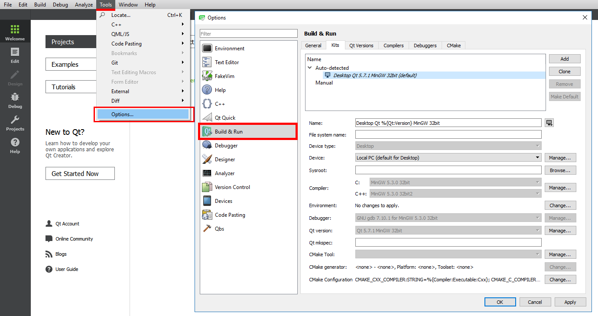
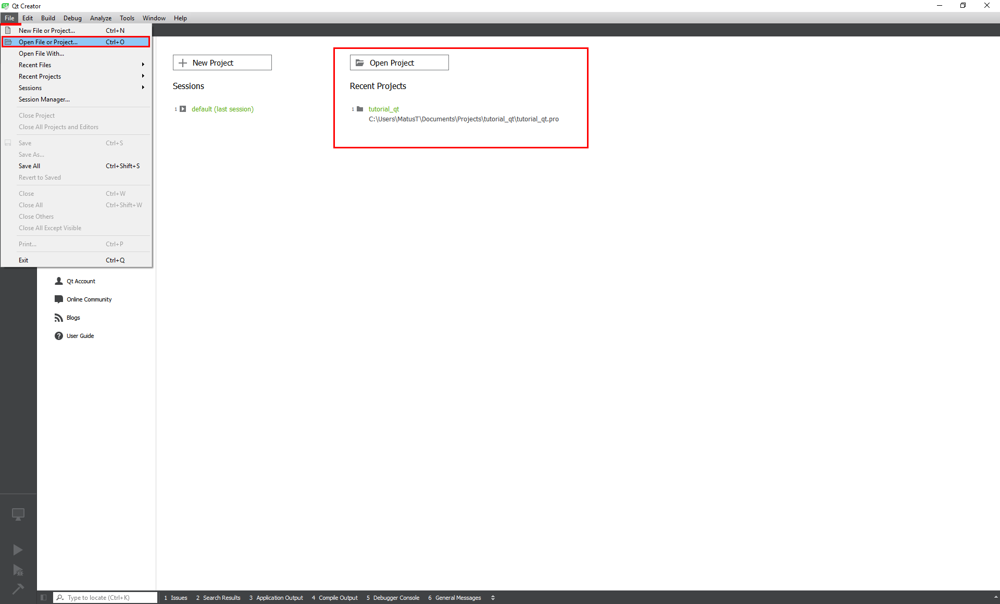
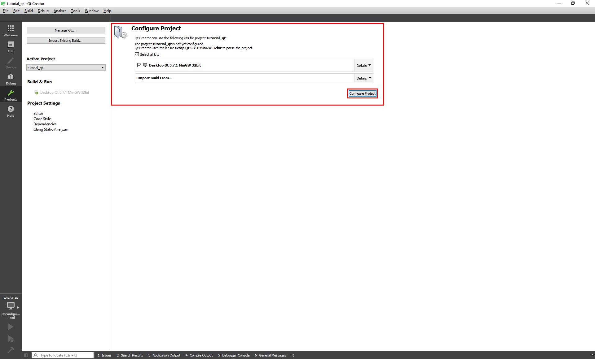
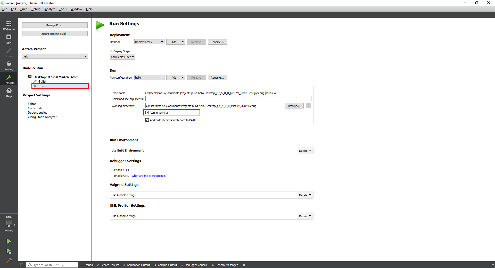
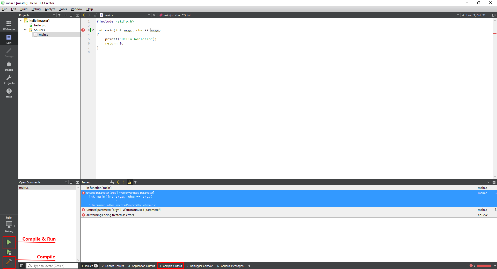
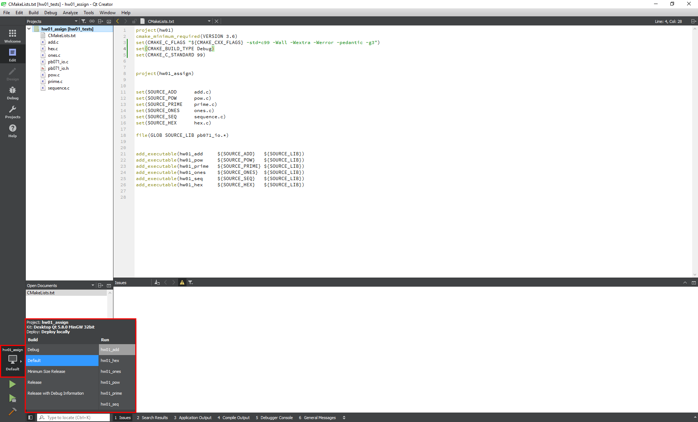

# Kompilácia {#intro}

Ak ste postupovali podľa [návodu](/qt-creator/installation.md) pri inštalácií, Qt Creator automaticky nájde všetky potrebné nástroje\(kompilátor, debugger, CMake, ...\) a vytvorí z nich použiteľné Kity.

## Kit {#kit}

Je termín, ktorý Qt Creator používa na označenie zoskupenia nástrojov slúžiacich na:

* otvorenie projektového súboru\(**CMake** pre súbory **CMakeLists.txt**\),
* kompiláciu projektu\(**gcc/MinGW**\),
* debuggovanie\(**gdb**\).

V menu **Tools → Options → Build & Run** môžete pridávať nové Kity alebo upravovať existujúce. Po inštalácii by ste mali skontrolovať, že Qt Creator automaticky pripravil použiteľný kit s nástrojmi: gcc/MinGW, gdb a CMake.

> v Predmete PB071 sa na Windowse bude primárne používať MinGW. V predmete PB161 je odporúčaný kompilátor MSVC.

> V prípade, že nebudete mať žiadny alebo chybný Kit\(ukazuje warning alebo error značku pri názve\), skontrolujte si postup inštalácie podľa návodu a prípadne sa obráťte na cvičiaceho.

## Otvorenie projektu {#open}

Otvorte projekt pomocou **File → Open Project...** . Zvoľte _CMakeLists.txt_ súbor. Po otvorení je projekt nájditeľný aj vo _Welcome_ obrazovke Qt Creatora v kategórii _Recent Projects_.

Pri otváraní sa Qt Creator opýta, ktoré Kity chcete použiť na prácu. Vystačíte si s jediným vyššie spomenutým.

## Spustenie {#run}

Pred spustením si skontrolujte nastavenie _Run in terminal_ v **Projects → Run**. Toto nastavenie je vhodné na testovanie aplikácie, tak ako sa reálne mimo editora spustí. Spúšťanie v editore je niekedy neprehľadné a nepraktické, hlavne pri zadávaní vstupu.

Následne stačí kliknúť na ikonku spustenia/kompilácie. Pri spustení sa automaticky skompilujú zmeny prevedené od poslednej kompilácie. Ak nastanú pri kompilácii chyby, budú zobrazené v okne **4 Compile Output**. Pri dvojitom kliknutí na jednotlivé chybové hlášky budete presmerovaný na súbor a riadok, kde kompilačná chyba nastala.

Ak projekt generuje viacej spustiteľných súborov, kliknutím na ikonku nad ikonkou spustenia programu môžete vybrať tú, ktorú chcete spustiť.  

# Kam ďalej {#next}

Po úspešnom prejdení tohoto návodu pokračujte [debuggovaním aplikácie](/qt-creator/debug.md).

