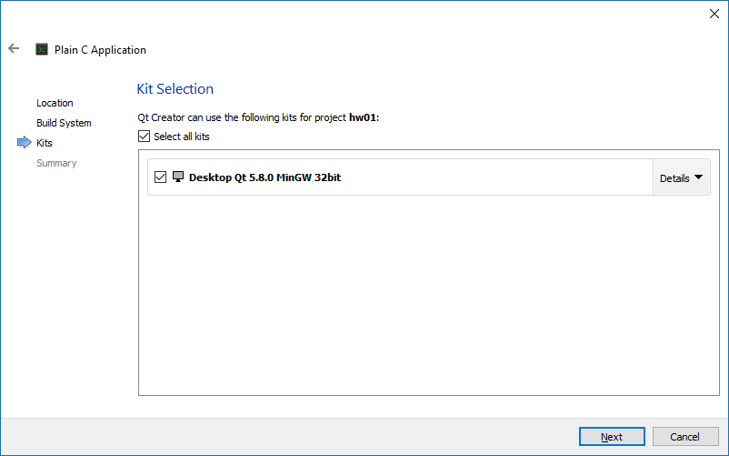
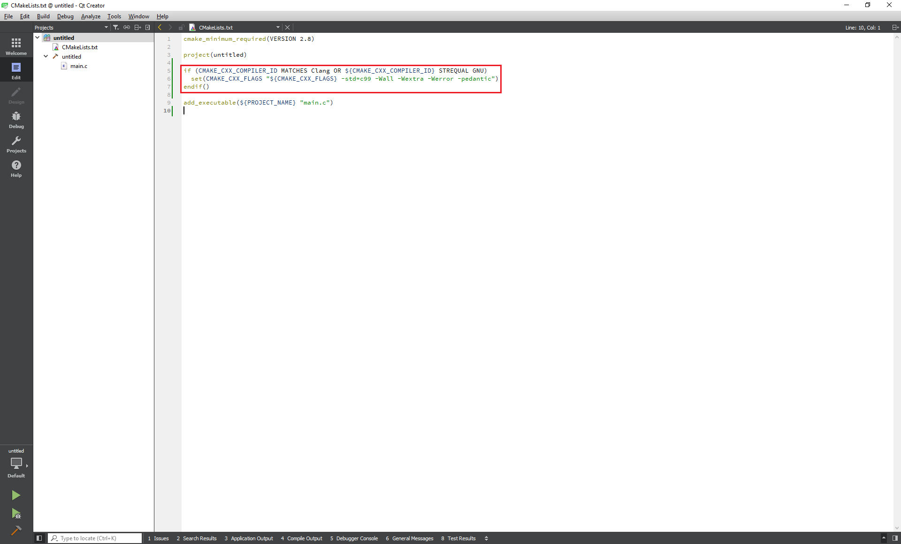
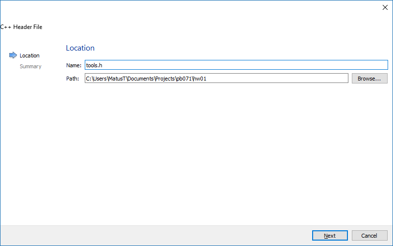
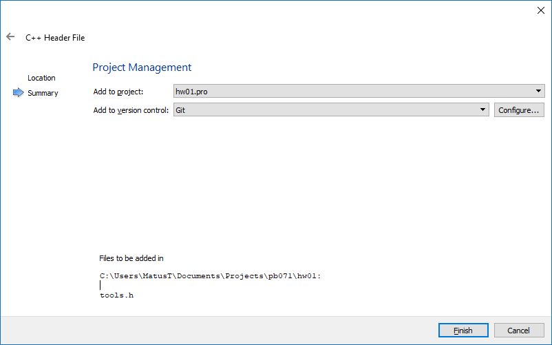

# Vytvorenie nového projektu {#intro}

1. Vyberte v menu **File → new File or Project** alebo **+ New Project** v úvodnej obrazovke:

  

2. Zvoľte typ projektu **Non-Qt Project → Plain C Application**:

  

3. Určite meno projektu, pre domáce úlohy používajte hw01-hw05. Pre projekt bude vytvorený folder s rovnakým názvom, aký ma projekt. Pokiaľ teda budete vytvárať hw0x projekt, ako cestu zvoľte repozitár úloh.

  

4. Build system nastavte na **CMake**:

  

5. Ak ste postupovali správne podľa návodu, budete mat minimálne kit s gcc(MinGW pre Windows).

  
  
6. Voľbu *Add to version control*, ktorá vytvorí _.gitignore_, vynechajte. Tento súbor Vám dodávame v každom repozitári.

  

7. Do konfiguračného súboru projektu(CMakeLists.txt) pridajte za deklaráciu project() nastavenia pre kompilátory:
   * Pre C99 (PB071)
   ```
   if (CMAKE_CXX_COMPILER_ID MATCHES Clang OR ${CMAKE_CXX_COMPILER_ID} STREQUAL GNU)
     set(CMAKE_CXX_FLAGS "${CMAKE_CXX_FLAGS} -std=c99 -Wall -Wextra -Werror -pedantic")
   endif()
   ```
   * Pre C++14 (PB161)
   ```
    if (CMAKE_CXX_COMPILER_ID MATCHES Clang OR ${CMAKE_CXX_COMPILER_ID} STREQUAL GNU)
      set(CMAKE_CXX_FLAGS "${CMAKE_CXX_FLAGS} -std=c++14 -Wall -Wextra -Werror -pedantic")
    elseif (${CMAKE_CXX_COMPILER_ID} STREQUAL MSVC)
      set(CMAKE_CXX_FLAGS "${CMAKE_CXX_FLAGS} /std=c++14 /permissive- /W4 /WX")
    endif()
   ```

   Jednotlivé nastavenia znamenajú nasledovné:
   - **std=c99/c++14** - nastaví štandard jazyka, podľa ktorého má kompilátor kontrolovať
   - **pedantic/permissive-** - nastaví striktné dodržiavanie štandardu - kompilátorom neprejdú žiadne rozšírenia štandardu, zahlási všetky chyby vyžadované štandardom,
   - **Wall** - skratka pre *Warnings All*, pri tomto nastavení bude kompilátor upozorňovať aj na možné chyby, ktoré nie sú vynucované štandardom,
   - **Werror** - skratka pre *Warning as error*, každé upozornenie bude brané ako chyba.
     
     
  
## Pridávanie nových súborov {#add-file}

1. Pre pridanie nového súboru do projektu zvoľte v menu **File → New File or Project**:

  
  
2. Z templatov vyberte **C++ → C++ Source/Header** - source pre zdrojový .c súbor a header pre hlavičkový .h súbor:

  

3. Pomenujte svoj súbor a umiestnite ho tam, kde sa nachádza Váš projekt(kde máte CMakeLists.txt):

  

4. Zvoľte projekt, do ktorého má byť pridaný. Ak ste na začiatku už zvolili projekt, tak bude prednastavený. Môžete tiež rovno tento súbor pridať do git repozitára. Qt Creator potom vykoná príkaz *git add vas_subor*.

  


# Kam ďalej {#next}

Pokračujte:
- [skompilovaním projektu](../qt-creator/compilation.md)
- [debuggovaním](../qt-creator/debug.md)