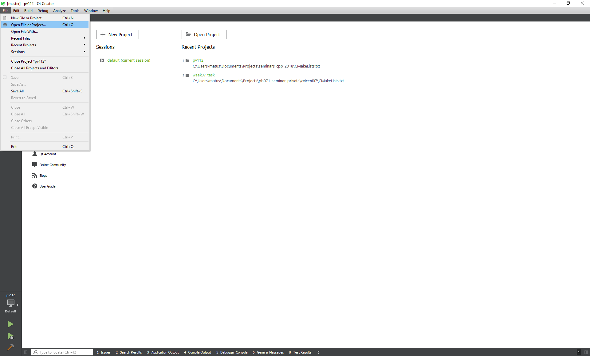
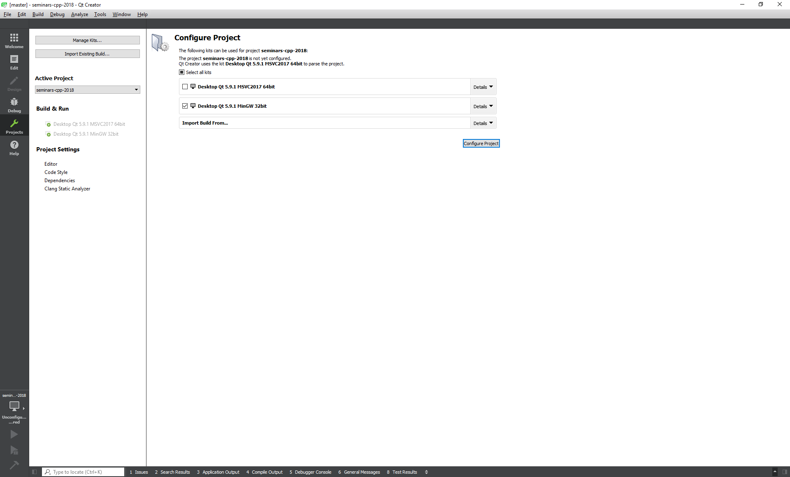
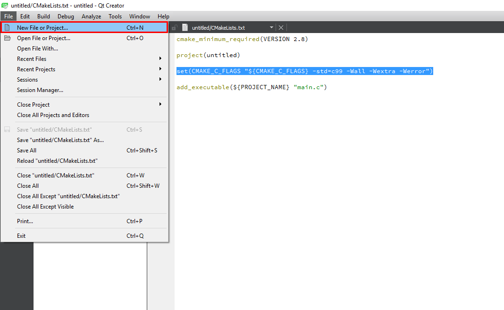
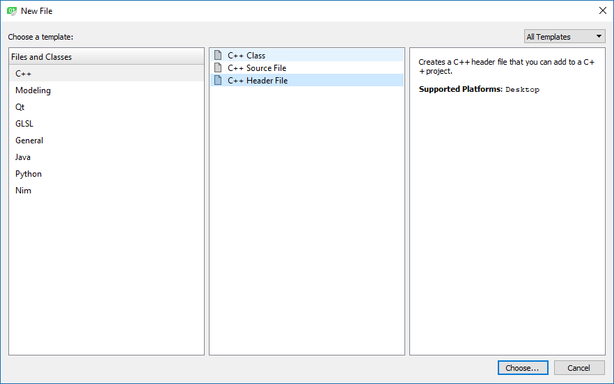
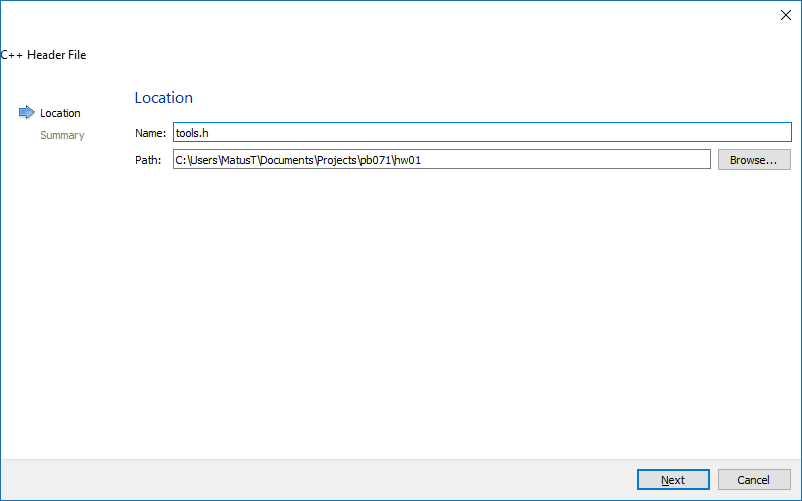
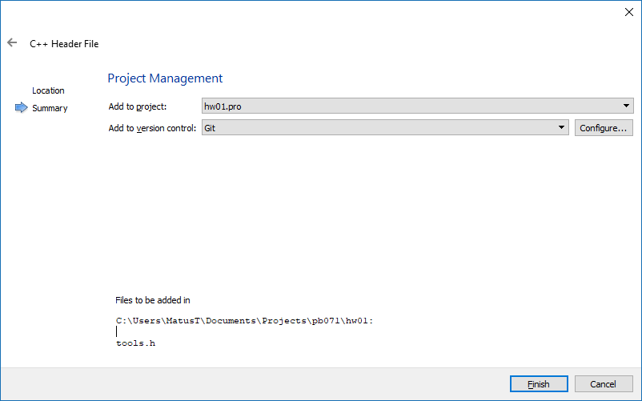

# Import projektu {#intro}

1. Vyberte v menu **File → Open File or Project** alebo **Open Project** v úvodnej obrazovke:
  

2. Zvoľte **CMakeLists.txt** projektu.

3. Ak ste postupovali správne podľa návodov, budete mat minimálne kit s gcc(MinGW pre Windows). Zvoľte gcc/MinGW kit a pokračujte s **Configure Project**.
  
  
## Pridávanie nových súborov {#add-file}

1. Pre pridanie nového súboru do projektu zvoľte v menu **File → New File or Project**:

  
  
2. Z templatov vyberte **C++ → C++ Source/Header** - source pre zdrojový .c súbor a header pre hlavičkový .h súbor:

  

3. Pomenujte svoj súbor a umiestnite ho tam, kde sa nachádza Váš projekt(kde máte CMakeLists.txt):

  

4. Zvoľte projekt, do ktorého má byť pridaný. Ak ste na začiatku už zvolili projekt, tak bude prednastavený. Môžete tiež rovno tento súbor pridať do git repozitára. Qt Creator potom vykoná príkaz *git add vas_subor*.

  

# Kam ďalej {#next}

Pokračujte:
- [skompilovaním projektu](../qt-creator/compilation.md)
- [debuggovaním](../qt-creator/debug.md)