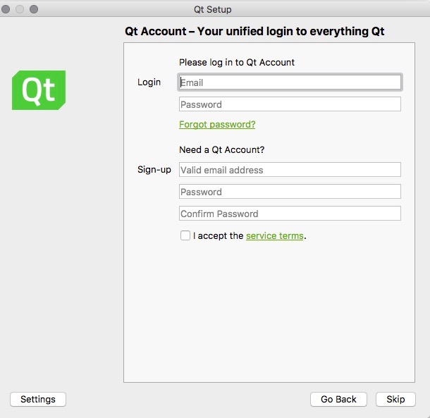
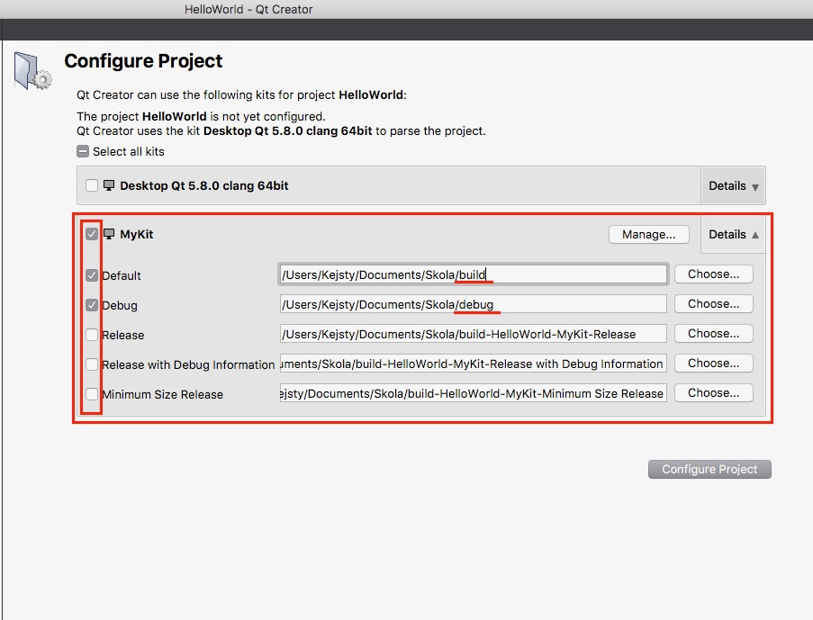

## Inštalácia Qt na macOS

Inštalačný súbor si stiahnite na [tejto](https://www.qt.io/download-open-source/) stránke. Kliknite na **Download Now**.


Otvorte stiahnuty súbor dvojklikom.


Dvojklikom na zelenú ikonku _Qt_ otvorte aplikáciu pre inštaláciu Qt creatoru \(1\). Kliknutím na _Open_ potvrďte jej otvorenie \(2\).


Otvoril sa vám sprievodca inštaláciou. Kliknite na **Continue**.


Inštalátor Vám v ďaľšom kroku ponúkne registráciu, ktorá nie je povinná a je možné ju preskočiť. V prípade, že sa rozhodnete túto možnosť využiť, účet Vám poslúži na prihlasovanie sa do [Qt Wiki](https://www.gitbook.com/book/matust/pb071-tutorials/edit#) a [Qt Fóra](https://www.gitbook.com/book/matust/pb071-tutorials/edit#).



Pokračujte dalej inštaláciou \(výber súboru pre inštaláciu, ...\), až kým sa nedostanete k časti výberu komponentov, ktoré sa majú nainštalovať, viď obrázok nižšie. Rozbalte **Qt 5.8** a vyberte jedinú možnosť a to macOS**. **Pokračujte ďalej.


Počkajte, kým sa stiahnú potrebné súbory pre inštaláciu. Táto časť môže zabrať dlhší čas. Po dokončení inštalácie môžete spustiť Vaše novo nainštalované IDE.




## Pridanie CMake do Qt

Najprv sa uistite, že máte nainštalovaný CMake, napríklad pomocou toho, že do terminálu napíšete:

```terminal
which cmake
```
Ak nie, CMake si nainštalujte napríklad podľa [návodu](/cmake/installation-macos.md).

Otvorte aplikáciu. V hornom menu vyberte možnosť **Qt Creator &gt Preferences... &gt Build & Run &gt CMake** a vyberte možnosť **Add**.

Ako meno zvolte ľubovoľný identifikátor pre CMake, pokojne nechajte pôvodný. Do path vložte cestu, ktorú vám povie terminál po zadaní 

```terminal
which cmake
```


## Pridanie Kompilátoru do Qt

V tomto predmete budeme používať kompilátor gcc. Uistite sa preto najprv, že tento kompilátor máte, napríklad napíšte do terminálu:

```terminal
which gcc
```
V opačnom prípade si ho nainštalujte.

Otvorte aplikáciu. V hornom menu vyberte možnosť **Qt Creator &gt Preferences... &gt Build & Run &gt Compilers** a skontrolujte, že vo výbere sa gcc nachádza.


Následne otvorte záložku Kits a skontrolujte, že Váš Kit má ako defaultný kompilátor pre C práve gcc.

Ak nie, odporúčam vytvoriť nový Kit. V záložke Kits kliknite na **Add** a novo pridaný Kit vyplňte nasledovne.


## Otvorenie projektu pomocou CMakeListu

Predpokladajme súbor _main.c_ a k nemu príslušný **CMakeList.txt**. Tento projekt chceme naimportovať do Qt.


Otvoríme aplikáciu a vyberieme možnosť **Open Project**, a vyberieme súbor **CMakeList.txt**.
Následne vyberieme, ktorý Kit chceme použiť. Príklad predpokladá, že bol vytvorený nový Kit s menom **MyKit**.

Vyplňte možnosti podľa príkladu a kliknite na **Configure Project**:




