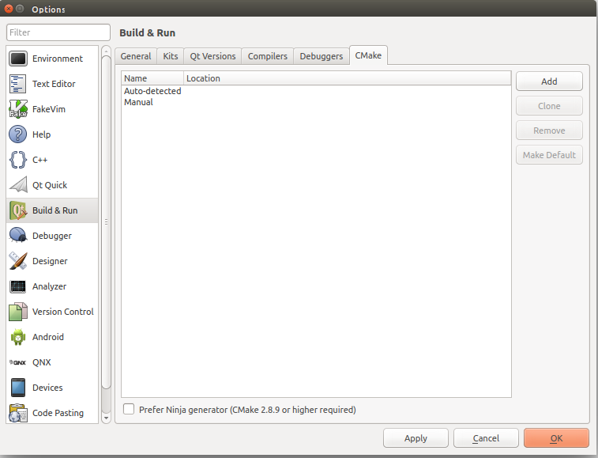

# Pridanie Cmake do Qt


Otvorte aplikáciu Qt Creator. V hornom menu vyberte záložku **Tools &gt Options...&gt Build & Run &gt Cmake**



Vyberte možnosť **Add**. Ako meno zvoľte ľubovolné označenie (pokojne nechajte to, čo bolo defaultne zvolené), a ako **Path** zvoľte cestu k cmake.

Ak Cmake nemáte nainštalované, nainštalujte si ho napríklad podľa [návodu](/git/cmake.md).

Ak Cmake máte, Path zistíte nasledovne:

Pre Linux a OS X otvorte terminál a napíšte 

```
which cmake
```