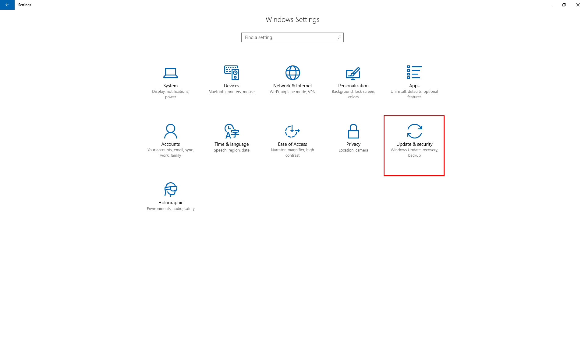
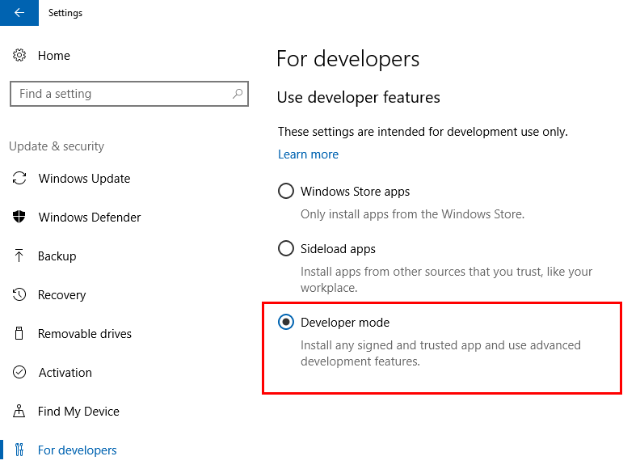
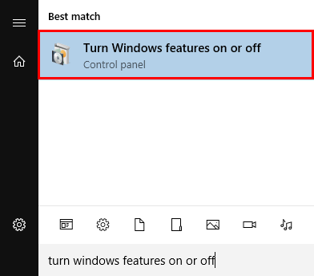
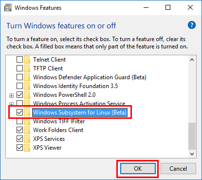
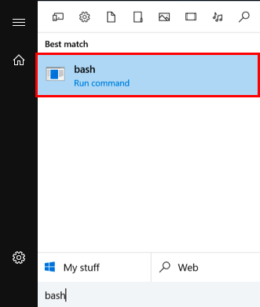
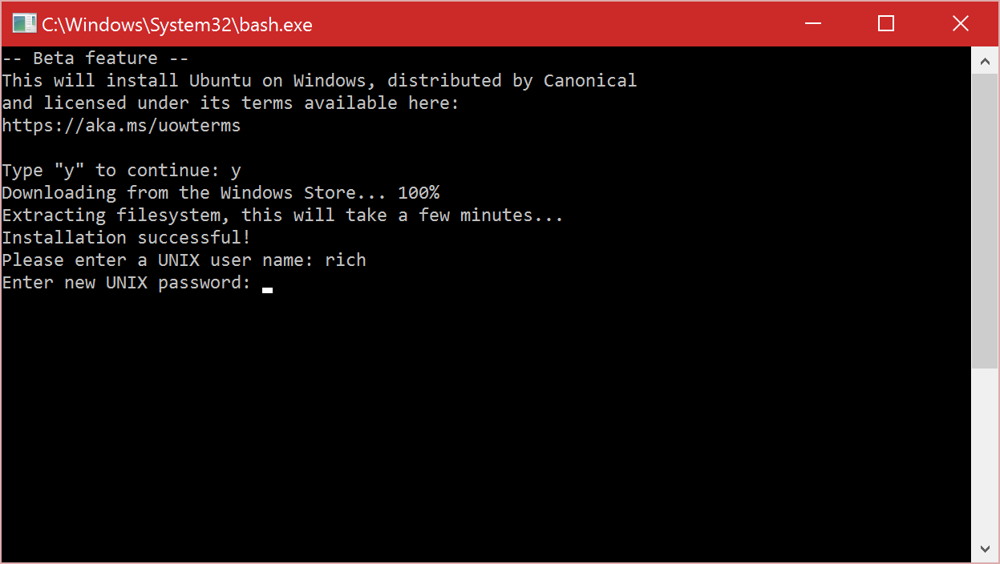
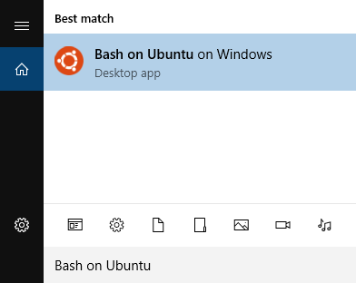
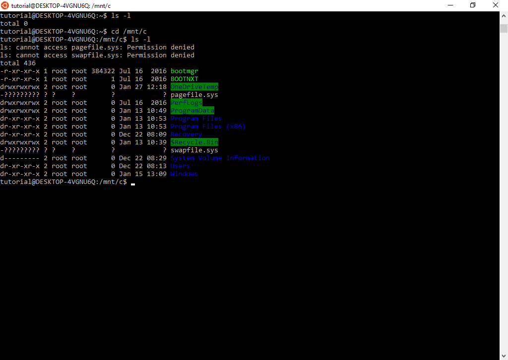

# Inštalácia {#installation}

1. V nastaveniach zvoľte **Update & Security**.

  

2. Zapnite si **Developer mode** pre Windows 10.

  

3. Cez vyhľadávanie nájdite a otvorte **Turn Windows features on or off**.

  

4. Nájdite položku **Windows Subsystem for Linux (Beta)**, zaškrtnite ju a potvrďte. Následne **reštartujte **Windows.

  

5. Po reštarte vyhľadajte program **bash** a spustite. 

  
  
6. Napíšte **y** a stlačte Enter pre potvrdenie inštalácie. V ďalšom kroku vytvorte účet administrátora linuxového systému - tento účet sa nemusí zhodovať s Vaším Windows účtom.

  

# Prvé kroky {#start}

Po úspešnom nainštalovaní môžete spúštať aplikáciu **Bash on Ubuntu on Windows**. Je to plnohodnotné Ubuntu a teda všetky linuxové príkazy v ňom budú fungovať.



Na začiatok je odporúčané updatovať Ubuntu pomocou príkazu:
```
sudo apt update && sudo apt upgrade
```

# Prístup k súborom {#filesystem}

Ubuntu on Windows má svoj vyhradený priestor oddelený od Windowsu. Pokiaľ chcete pristúpiť k dátam Windowsu, musíte sa presunúť v príkazovom riadku do adresára **/mnt/c/** pomocou príkazu:
```
cd /mnt/c/
```
V priečinku **/mnt/c/** sa nachádza partícia **C:/**. Pre vrátenie sa do domovského adresára Ubuntu použite:
```
cd ~
```



