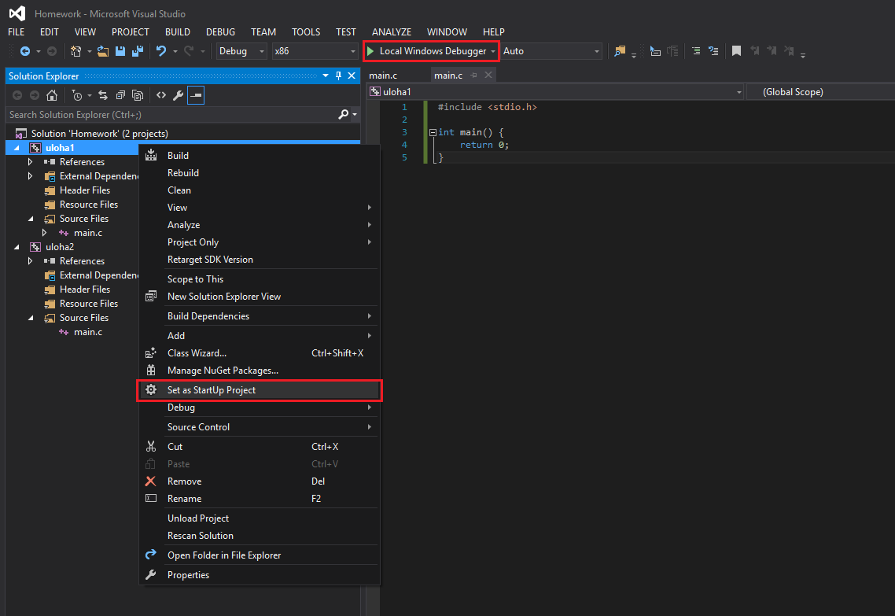

# Spustenie projektu

Keď obsahuje solution niekoľko projektov, jeden môžete zvoliť ako spúštací pravým kliknutím na jeho meno a voľbou **Set as StartUp Project**. Následne na spustenie stačí kliknúť na **Local Windows Debugger**:

