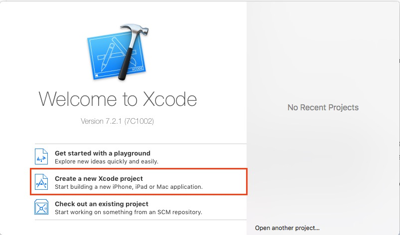
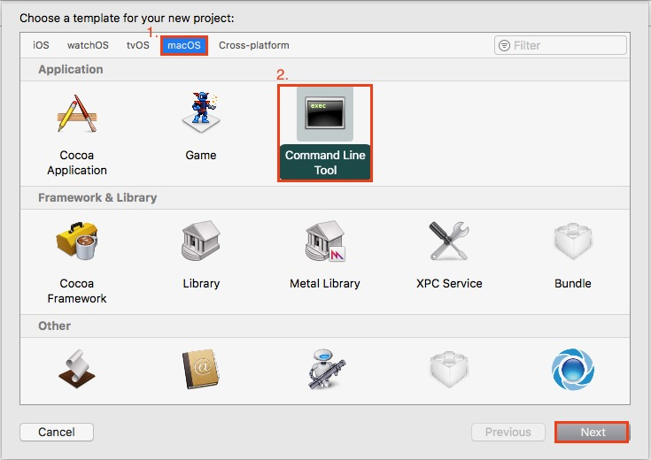
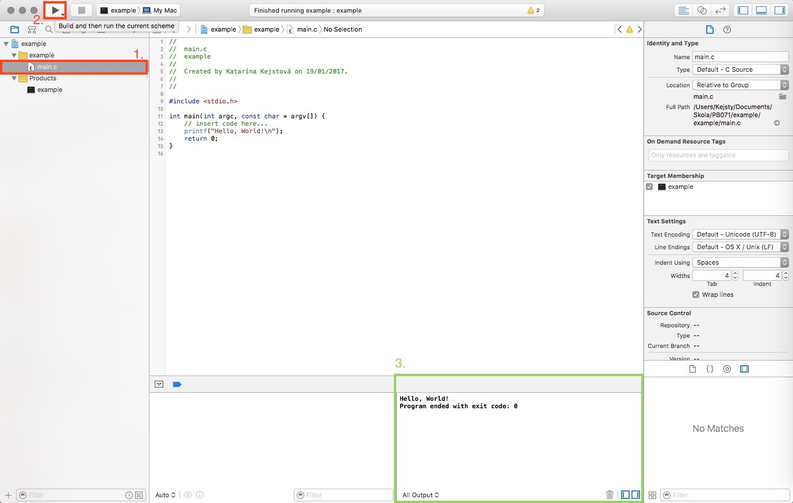
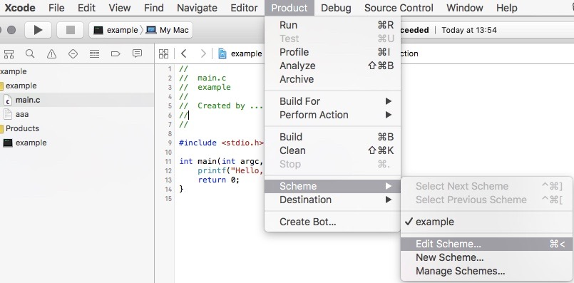

## Spustenie projektu {#xcode-run}

Otvorte Xcode. V úvodnom okne, ktoré sa otvorí, vyberte možnosť _Create a new Xcode project_

Vyberte možnosť **macOS\(1.\) &gt; Application &gt; Command Line Tool**\(2.\), a kliknite na Next.

Prichádza časť, kde pomenujeme náš nový projekt. Doplňte meno \(napr.  _example_\) a indentifikátor organizácie  
\(napr. _PB071_\).  Identifikátor organizácie môže byť ľubovolný výraz, má význam až pri väčších projektoch. Spojenie mena a identifikátora vytvorí BundleID, ktoré bude unikátnym ID vašej aplikácie.

Ako jazyk zvolte C. Kliknite na Next.

Xcode pre vás automaticky vytvoril projekt s názvom example, a s ukážkovým **main.c** súborom, obsahujúcim základný _Hello World_ program. Ten sa dá preskúmať po kliknutí na súbor **main.c** v záložke example \(1. krok\).

Tento súbor je taktiež skompilovateľný, a následne spustiteľný. Kliknite na ikonku pre "Run" \(2. krok\). Aplikácia spustí automaticky Build, a následne Run. Po úspešnom zbehnutí programu sa dole vpravo v "Debug area"  zobrazí výstup programu a informácioa o výstupnom kóde. V tomto prípade "exit code: 0" znamená, že program zbehol bez problémov.

Samotný run projektu prebieha v špeciálnej zložke, ktorú defaultne vygeneruje Xcode. Tomuto sa chceme vyhnút v prípade, že naša aplikácia načítava súbor, a teda chceme sami nastaviť, kde bude program spustený, chceme nastaviť takzvanú _working directory_.

Pre nastavenie _working directory_ nájdite v hornej lište položku "Product". Otvorte **Product &gt; Scheme &gt; Edit Scheme...**

V otvorenom okne, v pravom menu vyberte možnosť "Run" \(1.\), následne v hornej lište vyberte záložku "Options"\(2.\).  
Zašktnite box pri "Working Directory - Use custom working directory", a nastavte požadovanú cestu na tú, v ktorej sa má program spustiť. Pre potreby tohto predmetu to bude pravdepodobne priečinok, v ktorom sa nachádza súbor **main.c.**

